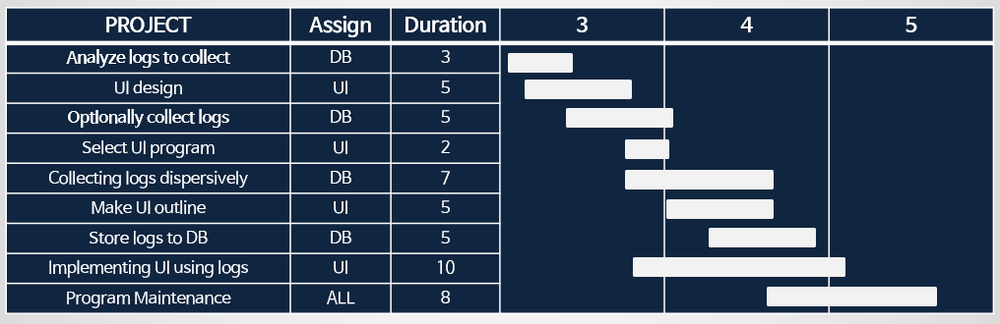
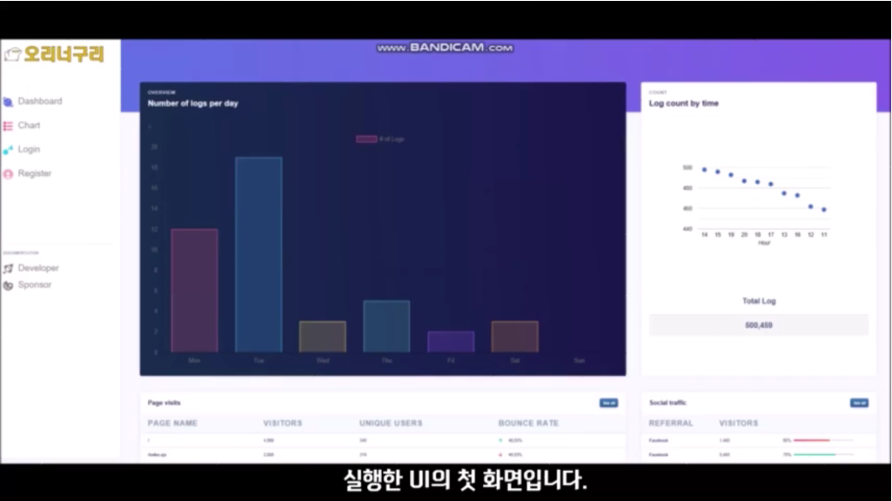
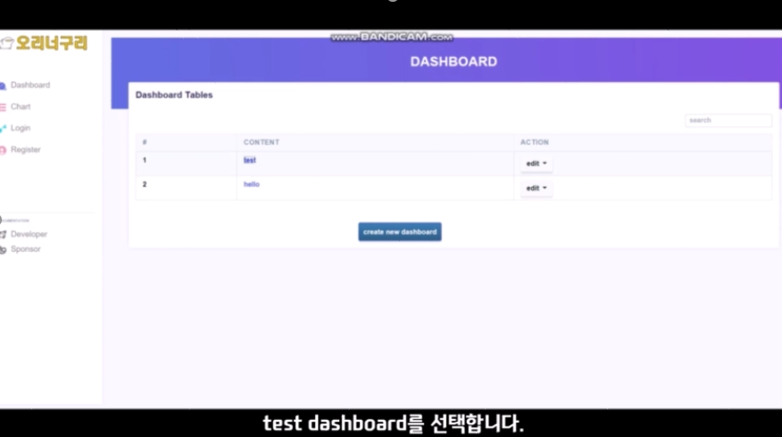
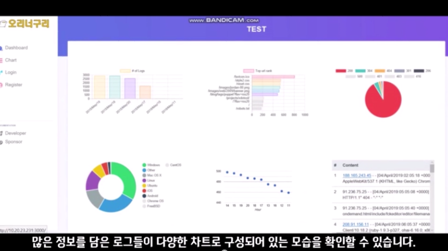

# 분산형 로그 분석기 및 수집현황 UI

## 정의 
분산형 애플리케이션에서 생성되는 다양한 형태의 대용량 로그들을 수집하여 별도의 DB에 적재 <br>
적재된 로그 데이터 중 유효한 데이터를 분석한 후, 
선택적으로 가져와 로그 수집현황 및 검색 UI 개발 
<br><br>

## 구현 방법
1. Apache tomcat을 활용하여 웹 서버를 만들고 해당 웹 서버에 접근했을 때 생성되는
다양한 로그들을 Filebeat 프로그램을 통해 중앙 서버로 실시간으로 전송합니다.
2. Filebeat는 로그 데이터가 발생할 때마다 로그 데이터를 읽고 집계한 후 설정에서
지정된 출력으로 지정한 로그 파일에 로그 데이터를 보냅니다. 
3. 중앙 서버는 로그 데이터를 수집한 후 전달하는 오픈소스 데이터 수집 엔진인
Logstash를 구동하고 logstash.conf 파일을 수정하여 로그의 내용이 올바르게
parsing 되어 데이터베이스에 적재될 수 있도록 합니다.
4. Logstash와 연동된 검색엔진인 Elasticsearch 데이터베이스에 parsing된 로그 데이터
를 저장한 후 해당 데이터를 검색 및 분석합니다.
5. Elasticsearch 쿼리문을 작성하여 데이터베이스에 적재된 로그 데이터를 선택적으로
가져옵니다. 이후, node.js 소프트웨어 플랫폼을 사용하여 가져온 로그데이터들의 정
보를 활용하여 UI를 구현합니다.
<br><br>

## 개발 일정

<br><br>

## 기능
1. 메인 화면


2. 대쉬보드


3. 대쉬보드 조회


4. 차트 추가


5. 차트 종류 조회

<br><br>

## 사용기술
- FileBat
- Logstash
- ElasticSearch
- Kibana
- nodejs

## 팀원 및 업무분담
- 이승희 : 로그 발생 및 수집
- 임소리 : 수집된 로그 data 선택적으로 DB 적재
- 고유진 : Backend 개발
- 김유리 : Front 개발
<br><br>

## 개발기간
- 약 4달
<br><br>

## 개발 환경 설정

### Apach tomcat 실행
```
./startup.sh
```
### filebeat 실행
```
./filebeat -e -c /etc/filebeat/filebeat.yml -d "publish"
```
### logstash 실행
```
./logstash -f /etc/logstash/conf.d/logstash.conf
```
### elasticsearch 실행
```
./elasticsearch
```
### node.js 실행
```
npm install
npm start
```